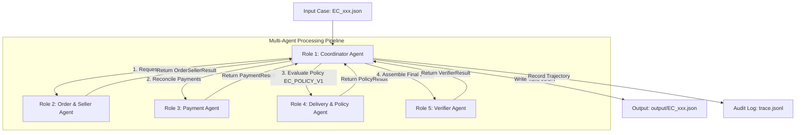
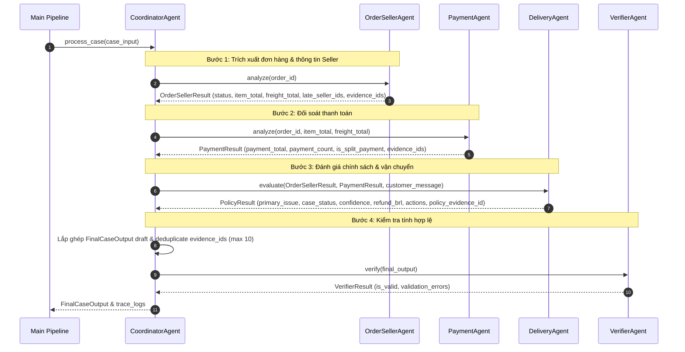

# Kiến trúc Hệ thống Multi-Agent — E-commerce Dispute Resolution

Tài liệu mô tả chi tiết thiết kế kiến trúc hệ thống Multi-Agent giải quyết khiếu nại thương mại điện tử Olist cho 50 case khách hàng.

---

## 1. Sơ đồ Kiến trúc Tổng quan (Overall Multi-Agent System)



---

## 2. Vai trò & Nhiệm vụ của các Agent

| Agent | Module / Class | Vai trò & Nhiệm vụ chính |
|---|---|---|
| **Role 1: Coordinator Agent** | `src/agents/coordinator_agent.py` | Tiếp nhận case khiếu nại, phân giao nhiệm vụ (handoff) đến các Sub-Agent, tổng hợp chứng cứ và lắp ghép kết quả cuối cùng. |
| **Role 2: Order & Seller Agent** | `src/agents/order_seller_agent.py` | Kiểm tra trạng thái đơn hàng, thông tin các item, danh sách seller_id và tính toán cờ bàn giao trễ của seller (`shipping_limit_date`). |
| **Role 3: Payment Agent** | `src/agents/payment_agent.py` | Truy vấn dòng thanh toán, tính tổng tiền payment, đối soát tổng tiền với (item + freight) và phát hiện thanh toán chia nhỏ (split payment). |
| **Role 4: Delivery & Policy Agent** | `src/agents/delivery_agent.py` | So sánh mốc thời gian giao hàng thực tế vs dự kiến, phân định trách nhiệm (Seller vs Carrier) và áp dụng bộ quy tắc `EC_POLICY_V1` để đề xuất tiền hoàn và action. |
| **Role 5: Verifier Agent** | `src/agents/verifier_agent.py` | Validate toàn bộ Output JSON trước khi ghi file, đảm bảo khớp 100% Schema, đúng giới hạn số lượng ID ($\le 5$ entities, $\le 10$ evidences) và `confidence` $\in [0, 1]$. |

---

## 3. Quyền Truy cập Dữ liệu (Data Access Scope)

| Agent | Nguồn Dữ liệu Được Truy cập | Quyền hạn |
|---|---|---|
| **Coordinator Agent** | `input/EC_xxx.json` | Read Input Case, Write Output `output/EC_xxx.json` & `trace.jsonl` |
| **Order & Seller Agent** | `data/olist_orders_dataset.csv`, `data/olist_order_items_dataset.csv`, `data/olist_sellers_dataset.csv` | Read-only |
| **Payment Agent** | `data/olist_order_payments_dataset.csv` | Read-only |
| **Delivery & Policy Agent** | `data/olist_orders_dataset.csv`, `data/olist_order_items_dataset.csv`, OpenRouter LLM API | Read-only & LLM Reasoning |
| **Verifier Agent** | In-memory `FinalCaseOutput` Draft Object | Read-only Validation |

---

## 4. Luồng Handoff Chi tiết giữa các Agent (Sequence Diagram)



---

## 5. Decision Flow của Delivery & Policy Agent (Role 4)

```mermaid
flowchart TD
    START[Nhận OrderSellerResult & PaymentResult] --> CHECK_STATUS{Order Status là Canceled / Unavailable?}
    
    CHECK_STATUS -->|Canceled| R1[primary_issue: canceled_order_paid\nrefund: payment_total\naction: issue_full_refund]
    CHECK_STATUS -->|Unavailable| R2[primary_issue: unavailable_order_paid\nrefund: payment_total\naction: issue_full_refund]
    
    CHECK_STATUS -->|Delivered| CHECK_DELIV{order_delivered_customer_date > order_estimated_delivery_date?}
    
    CHECK_DELIV -->|Không (Đúng/Sớm hạn)| R6[primary_issue: unsupported_late_claim\nrefund: 0.0\naction: reject_late_refund]
    
    CHECK_DELIV -->|Có (Giao trễ)| CHECK_CARRIER{order_delivered_carrier_date > shipping_limit_date?}
    
    CHECK_CARRIER -->|Có (Seller trễ)| R3[primary_issue: late_delivery_seller\nparty: seller\nrefund: freight_total\naction: refund_freight]
    CHECK_CARRIER -->|Không (Logistics trễ)| R4[primary_issue: late_delivery_logistics\nparty: logistics_provider\nrefund: freight_total\naction: refund_freight]
```

---

## 6. Data Contracts & Output Validation

Mọi dữ liệu truyền qua lại giữa các Agent đều tuân thủ các Pydantic class chuẩn định nghĩa tại `src/contracts.py`:

- **`OrderSellerResult`**: Chứa thông tin tổng tiền item, tổng freight, mốc bàn giao và danh sách ID của Seller.
- **`PaymentResult`**: Chứa thông tin tổng tiền thanh toán, số lượng dòng thanh toán và cờ split payment.
- **`PolicyResult`**: Chứa kết quả đánh giá chính sách, mức hoàn tiền, bên chịu trách nhiệm và hành động xử lý.
- **`FinalCaseOutput`**: Cấu trúc JSON chuẩn cuối cùng nộp cho 50 case khiếu nại.